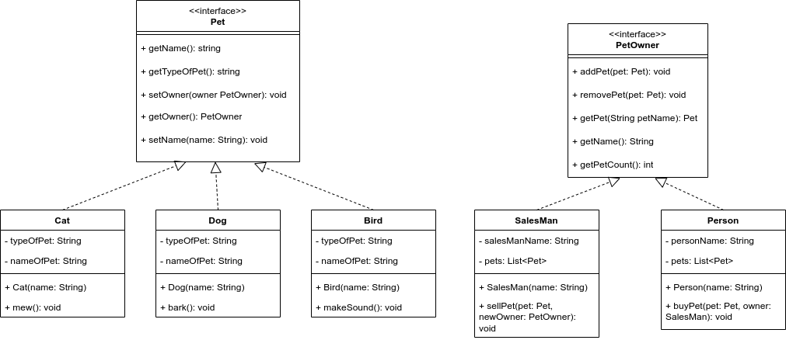

# Java Program for Pet Management System with appropriate OOP Concept and Design Process.

This is a sample java program to simulate the buying and selling of pets. The system has 3 types of pets, and two types of pet owners. Here, SalesMan can sell pets to any type of PetOwner while Person is limited to only buying pets from SalesMan.
